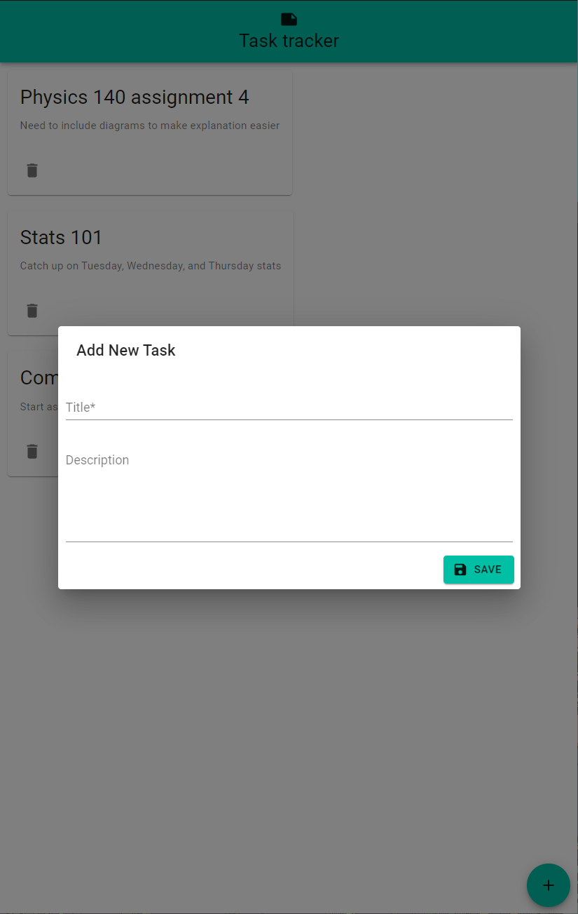
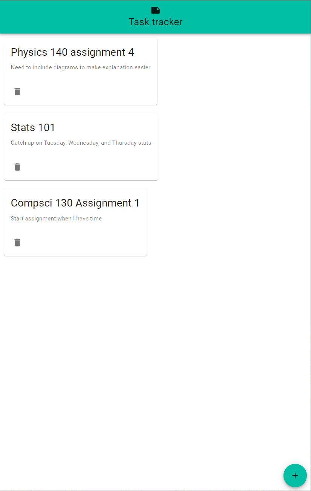

# Mern Task Tracker

A simple webapp for keeping track of tasks that need to be completed, using CRUD operations.

## Installation

### Server

1. Navigate to the `/backend`  folder
2. `npm install` to install the required packages and dependencies
3. Make sure to have MongoDB installed and replace the `mongoDB` url found in `backend.js` with your own url
4. Run `npm start` to start Express server, which will default to port 8000

### Client

1. Navigate to the `/client` folder
2. `npm install` to install the required packages and dependencies
3. Add your own `.env` and paste in `REACT_APP_BACKEND_URL = "<your own backend url here>"`
4. `npm start` to start the React server, which will be running on port `3000`

## Screenshots

